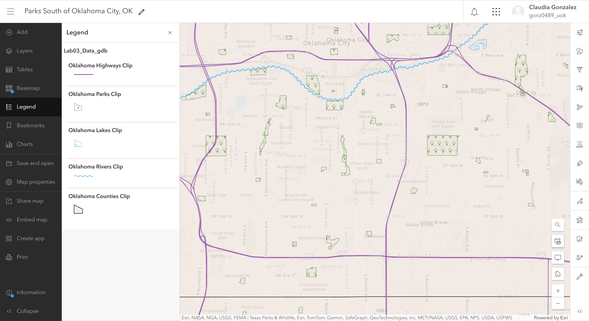

## Portfolio

---

### Projects

- [Where in PNW-Washington is suitable for nesting sites?](https://storymaps.arcgis.com/stories/adb4a08bece6402687a8dda56e28ac95)
- [Campus Tree Collector Survey](https://survey123.arcgis.com/share/50d8d1fe9b5147f8b13d10e61668a63d?portalUrl=https://uok.maps.arcgis.com)
- [Project 3 Title](http://example.com/)
- [Project 4 Title](http://example.com/)
- [Project 5 Title](http://example.com/)

---

### Projects 

Parks South of OKC

---
[Project 2 Title](/pdf/sample_presentation.pdf)

---
[Project 3 Title](http://example.com/)

---

---

Page template forked from <a href="https://github.com/evanca/quick-portfolio">evanca</a>

<!-- Remove above link if you don't want to attibute -->
